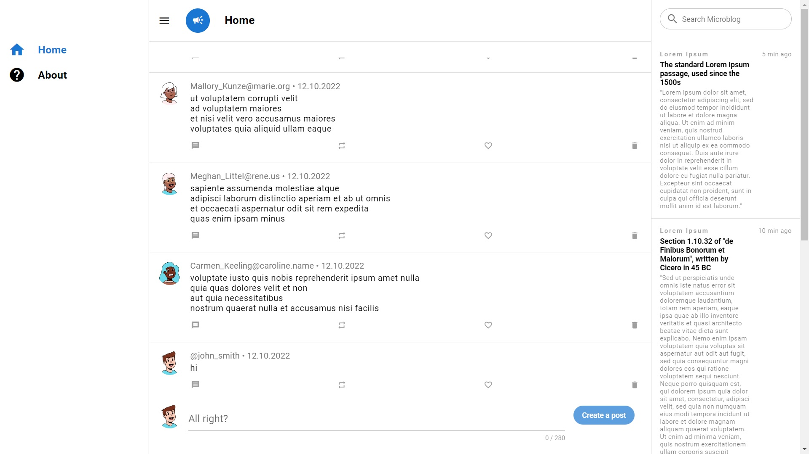

# Single page Website

This single page adaptive website with cross-browser compatibility. The site is overloaded with small details and is quite complex. Interesting css and js solutions have been applied. jQuery is not used. You can use these solutions to solve your problems. 

## Technical details

- Package manager: [Yarn]
- CSS preprocessor: [SCSS]
- Javascript transpiler: [Babel]
- Backend: [JSONPlaceholder]
- Frontend: [Vue3] [Quasar_Framework]
- Tools: [Webpack]
- Browser support: Chrome, Safari, newer versions of Opera, almost all iOS browsers including Firefox for iOS, basically, any WebKit based browser, Firefox, old pre-WebKit versions of Opera Internet Explorer and Microsoft Edge.

## Tools:

- site adaptability;
- the frontend is assembled in the "client" folder;
- DiceBear library was used to generate avatars (https://avatars.dicebear.com/);
- placeholder text is used (https://www.lipsum.com/).

## Project demo (website pages)

